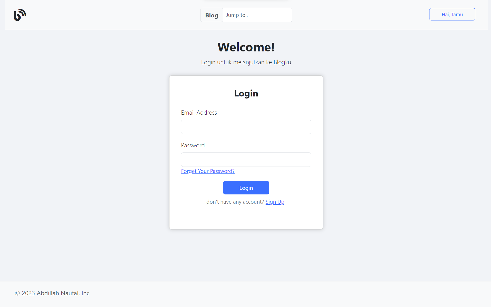
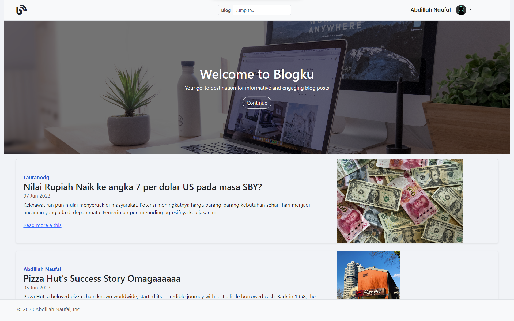
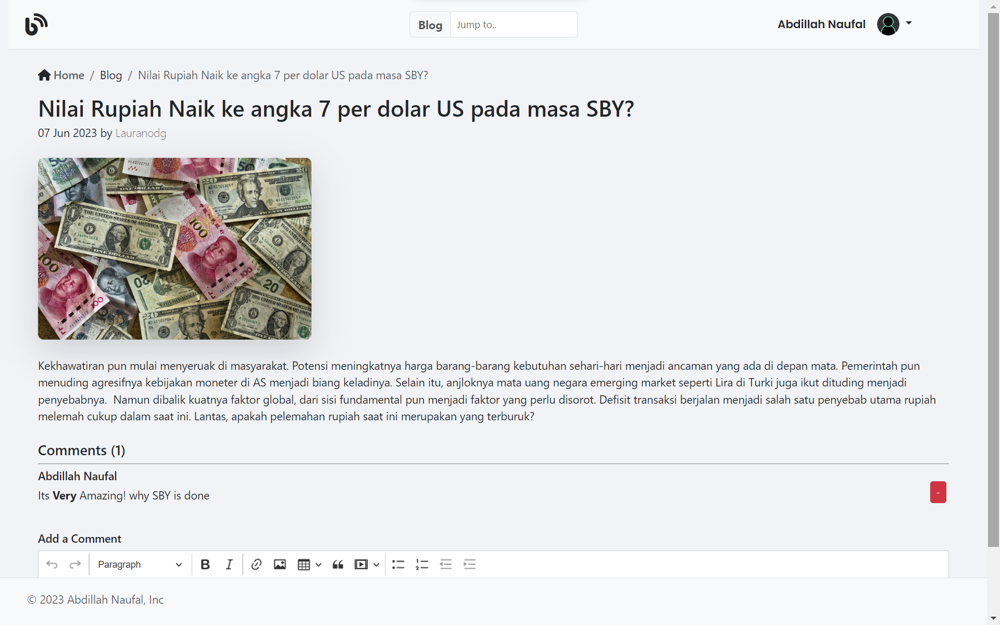
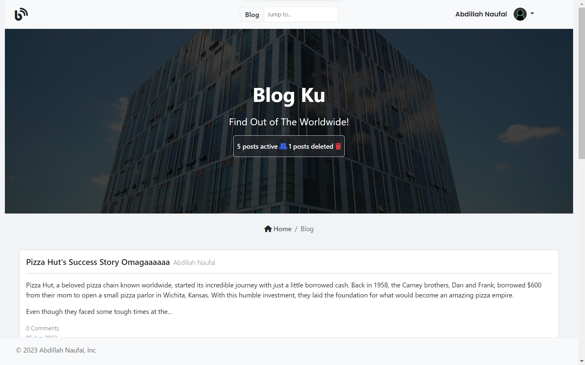
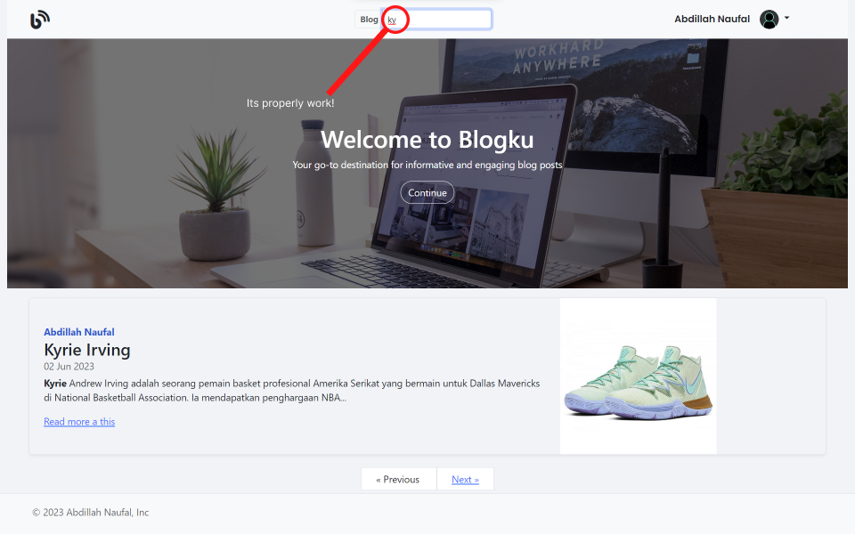
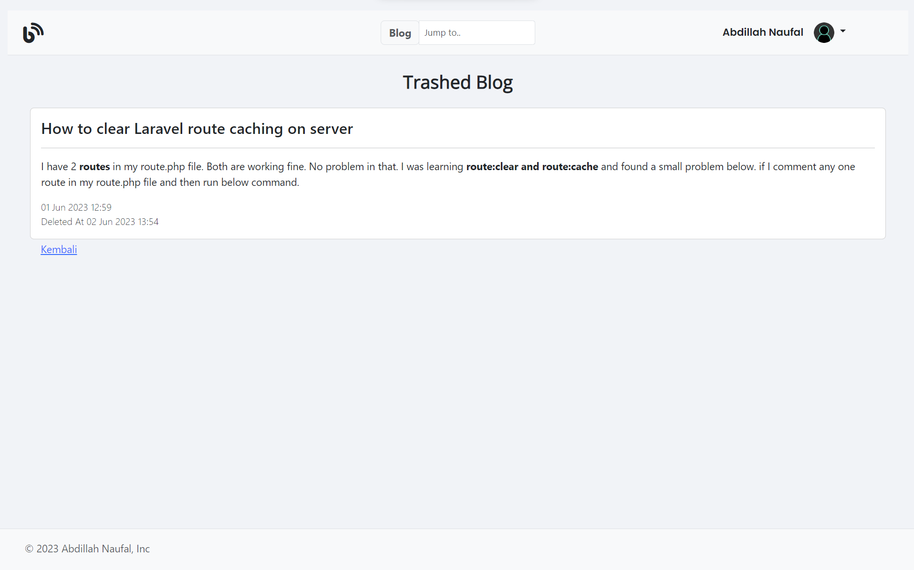

# Simple Laravel Blog
Welcome to the Simple Laravel Blog repository! This repository contains a basic blogging application built using the Laravel framework. With this application, you can create, edit, and manage blog posts.

# Table of Contents
Screenshots
Installation
Usage
Features
Contributing
License

## Screenshots

## Installation
To get started with the Simple Laravel Blog, follow these steps:

Clone the repository to your local machine:

git clone https://github.com/abdFal/Simple-Laravel-Blog.git
Navigate to the project directory:

cd Simple-Laravel-Blog
Install the required dependencies using Composer:

composer install
Copy the .env.example file and rename it to .env:

cp .env.example .env
Generate an application key:

php artisan key:generate
Create an empty database for the application.

Update the database configuration in the .env file with your database credentials:

DB_CONNECTION=mysql
DB_HOST=127.0.0.1
DB_PORT=3306
DB_DATABASE=your_database
DB_USERNAME=your_username
DB_PASSWORD=your_password
Run the database migrations to create the necessary tables:

php artisan migrate
Start the development server:

php artisan serve
The application should now be running at http://localhost:8000.

## Usage
Once the application is up and running, you can access it by visiting http://localhost:8000 in your web browser. Here are some key features and functionalities available in the Simple Laravel Blog:

## Features
User Registration: Users can register an account to create and manage their blog posts.
Authentication: Users can log in and log out of their accounts.
Create Blog Posts: Authenticated users can create new blog posts.
Edit and Delete Posts: Users can edit and delete their own posts.
View Blog Posts: Users can view all blog posts and read individual posts.
Comments: Users can comment on blog posts.
Tags: Posts can be tagged with relevant tags for better categorization.
Search: Users can search for blog posts using keywords.
Pagination: The blog posts are paginated for better navigation.
Features
The Simple Laravel Blog offers the following features:

User management (registration, login, logout)
CRUD operations for blog posts
Commenting system
Tagging system
Search functionality
Pagination
The application is built using the Laravel PHP framework, which provides a solid foundation for secure and scalable web applications. It follows the Model-View-Controller (MVC) architectural pattern, making it easy to understand and extend.

## Contributing
Contributions to the Simple Laravel Blog are welcome! If you have any ideas, suggestions, or bug reports, please open an issue on the GitHub repository or submit a pull request.

When contributing, please follow these guidelines:

Fork the repository and create a new branch for your contribution.
Ensure your code follows the existing coding style and conventions.
Write clear commit messages and provide a detailed description of your changes.
Test your changes thoroughly before submitting a pull request.
